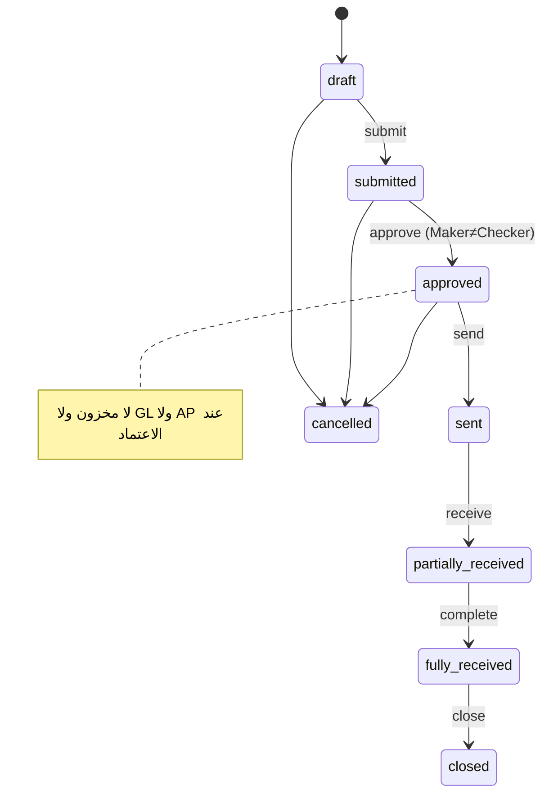

# معمارية منظومة المشتريات والموردين (Procure-to-Pay)

> وحدة واحدة تغطي الدورة الكاملة: **مورد → أمر شراء → استلام → فاتورة مورد → مطابقة ثلاثية → سداد → إرجاع**، بمصدر حقيقة واحد وكاتب مخزون واحد ونموذج GRNI محاسبي صحيح — داخل نفس الـRepository والخادم وقاعدة البيانات والجلسة، خلف علم `PROCUREMENT_P2P_ENABLE`.

## 1. المبدأ المعماري (Strangler-Fig — ADR-0001)

كود جديد في مجلدات جديدة؛ الكود القديم مُجمّد ويُعطَّل عند تفعيل العلم. إعادة استخدام مكثّفة:
`lib/glPosting.postJournal` (ترقيم JV ذرّي + فحص توازن + فحص فترة)، `lib/docNumber.nextDocNumber` (`doc_counters`)، `lib/stockRecompute.recomputeInvItemStock`، `middleware/warehouseScope`، `permissions_v3`/`role_permissions`.

```
lib/procurement/       errors · calculations · stateMachine · numbering · accounts ·
                       posting(GRNI) · events · http · config
services/procurement/  InventoryPostingService (الكاتب الوحيد) · TransitionExecutor
routes/procurement/    index · suppliers · orders · receipts · invoices · payments ·
                       returns · reports · dashboard   → /api/procurement/*
db/migrations/procurement/  ddlHelpers · schema · capabilities   (idempotent, MySQL8+MariaDB)
scripts/procurement/   migrate · reconcile · backfill · rollback
frontend/warehouse/src/features/procurement/  Layout(tabs) + pages
middleware/requireCapability.js
```

## 2. الكيانات (منفصلة منطقيًا — لا دمج)

| الكيان | الجدول | مطوّر/جديد |
|---|---|---|
| المورد | `suppliers` (+View `v_supplier_ap_balance`) | مطوّر |
| أمر الشراء | `purchase_orders` + `po_lines` | مطوّر |
| الاستلام (GRN) | `purchase_receipts` + `purchase_receipt_lines` | مطوّر |
| فاتورة المورد | `supplier_invoices` + `supplier_invoice_lines` | مطوّر |
| مطابقة الفاتورة | `supplier_invoice_matches` | جديد |
| الدفعة | `payment_records` | مُعاد استخدامه |
| تخصيص الدفعة | `payment_allocations` | جديد |
| المرتجع | `purchase_returns` + `purchase_return_lines` | جديد |
| حدث المشتريات | `procurement_events` | جديد |

كل المستندات تحمل: `version` (قفل تفاؤلي)، `idempotency_key` (UNIQUE)، أعمدة actor/timestamp لكل انتقال، ولقطات UoM على السطور (`entered_qty`, `entered_unit_code`, `conversion_factor_snapshot`, `base_qty`, `base_unit_price`). الأموال والكميات `DECIMAL`.

## 3. دورات الحالات



- **Receipt (GRN):** draft → approved → posted → reversed (أو cancelled).
- **Supplier Invoice:** draft → pending_review → approved → partially_paid → paid → closed (أو cancelled/credit_note).
- **Payment:** requested → authorized → paid → closed (أو cancelled/reversed).
- **Return:** draft → approved → posted → settled.

كل انتقال يمرّ عبر `TransitionExecutor.runTransition`: Transaction واحدة + إعادة تشغيل idempotent + قفل صف `FOR UPDATE` + فحص `expectedVersion` (conditional UPDATE) + حارس state-machine + أثر جانبي (مخزون/GL) + سطر `procurement_events` واحد + rollback كامل عند أي فشل.

## 4. نموذج GRNI المحاسبي (`lib/procurement/posting.js`)

| الحدث | القيد |
|---|---|
| ترحيل الاستلام | مدين **مخزون 1200** / دائن **GRNI 2150** (بلا ضريبة) |
| اعتماد فاتورة (مخزون) | مدين **GRNI 2150** + مدين **ضريبة مدخلات 1290** (+**فرق سعر 5350** عند التباين) / دائن **ذمم موردين 2100** |
| فاتورة (غير مخزون) | مدين **مصروف/أصل** + ضريبة مدخلات / دائن AP |
| تنفيذ السداد | مدين **AP 2100** / دائن **نقد 1110 \| بنك 1120** |
| إرجاع قبل الفاتورة | مدين **GRNI** / دائن **مخزون** |
| إرجاع بعد الفاتورة | مدين **AP** / دائن **مخزون** + دائن **ضريبة مدخلات** (عكس) |
| أي عكس | قيد معكوس مربوط بـ`reverses_journal_id`/`reversed_by_journal_id` |

- حساب **GRNI (كود `PROCUREMENT_GRNI_ACCOUNT_CODE`، افتراضي 2150)** يُنشأ Idempotently تحت الالتزامات المتداولة؛ يُرفض الترحيل إذا كان الحساب مفقودًا/غير نشط/تجميعيًا (`PROC_GRNI_STRUCTURAL`).
- حارس الفترة يمنع `closed` **و`locked`** (فحص `postJournal` وحده يمنع `closed` فقط).
- `postJournal` يُستدعى **داخل transaction المستند** (تمرير `conn`) لضمان الذرية بين ترقيم JV وكتابة المخزون.

## 5. الكاتب الموحّد وإزالة الازدواج

`services/procurement/InventoryPostingService` هو **المسار الوحيد** لكتابة `warehouse_stock`/`inv_items`/`purchase_lots`/`inventory_movements` للمشتريات:
`FOR UPDATE` على po_line + inv_item، حارس over-receipt + tolerance، WAC على `inv_items.cost` + `inventory_cost_history`، لوت لكل سطر (عكس/إرجاع lot-aware دون إعادة FEFO).

عند `PROCUREMENT_P2P_ENABLE=1` تُحوَّل مسارات الكتابة القديمة إلى بوابات 409:
`POST /api/purchases/receive/:id`، `/api/inventory/receive-request`، `/api/inventory/receive-approve/:id`، `/api/ap-invoices/:id/pay` → إعادة توجيه للوحدة الموحدة. عند العلم OFF تبقى المسارات القديمة بلا لمس (صفر مخاطرة).

## 6. API `/api/procurement`

مغلّف نجاح موحّد: `{ success, data, documentNumber, status, version, affectedStock, affectedValue, journalIds, auditEvent, warnings }`. أكواد خطأ موحّدة (`VALIDATION_ERROR, PERMISSION_DENIED, WAREHOUSE_ACCESS_DENIED, INVALID_STATE_TRANSITION, VERSION_CONFLICT, IDEMPOTENCY_CONFLICT, OVER_RECEIPT, MATCHING_VARIANCE, DUPLICATE_SUPPLIER_INVOICE, PAYMENT_OVER_ALLOCATION, GL_POSTING_FAILED, PERIOD_CLOSED, DOCUMENT_HAS_HISTORY, SUPPLIER_INACTIVE, …`).

- **suppliers**: `GET /` · `GET /search` · `POST /` · `GET /:id` · `PATCH /:id` · `POST /:id/(de)activate` · `GET /:id/(statement|aging|price-history)`
- **orders**: `GET /` · `POST /` · `GET /:id` · `PATCH /:id` · `POST /:id/(submit|approve|send|cancel|close|change-orders)` · `GET /:id/timeline`
- **receipts**: `GET /` · `POST /` · `GET /:id` · `POST /:id/(approve|post|reverse|cancel)`
- **invoices**: `GET /` · `POST /` · `GET /:id` · `POST /:id/(match|submit|approve|cancel|credit-note)`
- **payments**: `GET /` · `POST /` · `GET /:id` · `POST /:id/(authorize|pay|allocations|close|reverse|cancel)`
- **returns**: `GET /` · `POST /` · `GET /:id` · `PATCH /:id` · `POST /:id/(approve|post|reverse)`
- **reports**: `open-orders · receiving-variance · three-way-match · ap-aging · supplier-statement · purchase-analysis · price-variance · tax · data-quality`
- **dashboard**: `GET /dashboard`

كل القوائم: pagination خادمي + بحث + sort بـallowlist + فلاتر + إجماليات على كامل المجموعة + نطاق مستودعات + CSV بـBOM وحماية حقن الصيغ.

## 7. UoM

`entered_qty × factor = base_qty`؛ `baseUnitPrice = enteredPrice / factor`؛ `majorPrice = basePrice × factor`. المخزون/اللوت/WAC/GL دائمًا بالوحدة الأساسية؛ العرض يحفظ الوحدة المدخلة. مثال مُختبَر: **10 كراتين × 12 = 120 حبة**. الواجهة تعيد استخدام `UnitQtyInput` (تحويل حي) و`SearchableEntityCombobox`.

## 8. VAT

`resolveVatRate` لا يستخدم `|| 15` أبدًا؛ يدعم 15% / 0% / معفى (E) / خارج النطاق (O) عبر nullish وtax_code. الأعمدة `vat_rate`/`vat_pct` صارت NULLable لحفظ 0% الحقيقي. الإجماليات تُحسب في الخادم (لا يُوثق بالعميل). دعم inclusive/exclusive.

## 9. الأمان

JWT actor فقط، `requireCapability(procurement.*)` على كل mutation (صلاحيات فعّالة من `permissions_v3` مع override)، نطاق مستودعات في الخادم، Maker–Checker، parameterized SQL، منع Mass Assignment ومنع تعديل status عبر PATCH، 403 عام، optimistic concurrency، idempotency retention عبر `procurement_events`.
